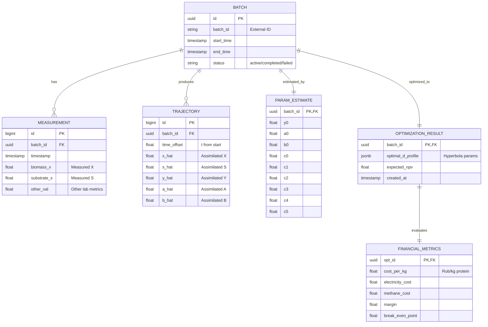

# ARCHITECTURE.md: Архитектура MVP системы подбора режимов ферментации

## 1. Общая схема потоков данных
Поток данных представляет собой замкнутый цикл от измерений к операционным рекомендациям:

`Измерения (Digital Twin/Lab)` $\rightarrow$ `PostgreSQL (Raw Data)` $\rightarrow$ `MND-Ассимилятор` $\rightarrow$ `Траектории (Assimilated)` $\rightarrow$ `Bayesian Optimizer (skopt)` $\rightarrow$ `Профиль D(t)` $\rightarrow$ `Финмодель` $\rightarrow$ `Рекомендация` $\rightarrow$ `n8n` $\rightarrow$ `Оператор`

## 2. Схема базы данных (PostgreSQL)

### ER-диаграмма (Mermaid)

## 3. Интерфейсы модулей (API)

### 3.1. `ode_model.py`
- **Input:** `(t, initial_state, params)`
- **Output:** `trajectories (ndarray)`
- **Responsibility:** Чистое решение системы ОДУ.

### 3.2. `mnd_assimilation.py`
- **Input:** `measurements (CSV/SQL) + initial_guess`
- **Output:** `best_params (dict), assimilated_trajectories (ndarray)`
- **Responsibility:** Поиск параметров $\theta$, минимизирующих RMSE между моделью и измерениями с использованием MND.

### 3.3. `regime_optimizer.py`
- **Input:** `current_params (dict), constraints`
- **Output:** `optimal_d_params (list), predicted_reward (NPV)`
- **Responsibility:** Поиск оптимального профиля $D(t)$ через `skopt.gp_minimize`.

### 3.4. `financial_model.py`
- **Input:** `trajectories, optimal_d, pricing_config`
- **Output:** `FinancialReport (object)`
- **Responsibility:** Перевод биохимических показателей в денежный эквивалент (NPV, OPEX).

## 4. Роль Claude Code в системе
Я выступаю в роли **Агент-Оркестратора**:
1. **Запуск:** Через n8n вызываю `run_pipeline.py`.
2. **Контроль:** Мониторю логи выполнения каждого модуля.
3. **Интерпретация:** Анализирую `FinancialReport` и сравниваю его с текущим режимом.
4. **Генерация:** Формирую финальный текстовый отчет для оператора:
   - "Рекомендую изменить профиль разбавления на [X], так как это снизит себестоимость на [Y] руб/кг при сохранении стабильности биомассы."
5. **Архивация:** Обеспечиваю запись всех результатов в PostgreSQL.
